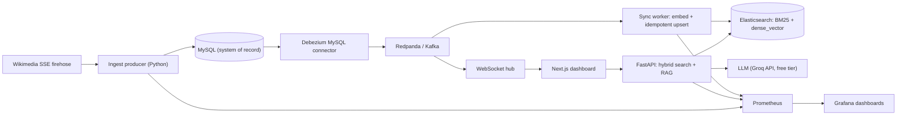

# PulseSearch

**Real-time, AI-native search over a live data firehose — Change Data Capture → Hybrid Search → Grounded RAG.** Local embeddings + free-tier Groq — no paid cloud services.

PulseSearch ingests a continuous stream of real-world change events (Wikipedia's live edit firehose), treats **MySQL** as the system of record, streams every row change through **Debezium + Kafka (Redpanda)** into **Elasticsearch**, and serves:

- **Hybrid search** combining BM25 (lexical) and dense-vector kNN (semantic) via **Reciprocal Rank Fusion**,
- a **grounded RAG assistant** (**Groq** hosted LLM, free tier) that answers questions over the *live* index with citations and freshness guarantees, and
- a **real-time WebSocket dashboard** that shows changes becoming searchable within seconds.

Everything runs on your machine with Docker Compose. Embeddings stay local; RAG uses a free Groq API key (no paid cloud services).

---

## Links

- **Case study:** https://shubhamsinha1010.github.io/work/pulsesearch.html
- **DeepWiki:** https://deepwiki.com/shubhamsinha1010/pulsesearch-cdc-rag

---

## Why this project exists

Most portfolio projects are CRUD apps or thin LLM wrappers. PulseSearch is deliberately a *systems* project: it wires together streaming CDC, search relevance engineering, real-time fan-out, and retrieval-augmented generation into one coherent, observable pipeline — the kind of infrastructure that powers real products.

---

## Architecture



**Data flow:** a page edit on Wikipedia → written to MySQL (`INSERT` on first sight, `UPDATE` on subsequent edits) → Debezium captures the binlog change → published to a Kafka topic → the worker consumes it, computes a sentence embedding, and performs a version-guarded upsert into Elasticsearch → the document is now searchable and the change is pushed live to every connected browser.

---

## Tech stack (all free / open-source)

| Concern | Choice |
| --- | --- |
| Firehose | Wikimedia EventStreams (`recentchange` SSE), no auth |
| System of record | MySQL 8 (binlog CDC) |
| CDC | Debezium 2.6 |
| Streaming log | Redpanda (Kafka API compatible) |
| Search | Elasticsearch 8 (`dense_vector` kNN, free Basic license) |
| Embeddings | `sentence-transformers/all-MiniLM-L6-v2` (384-dim, local) |
| LLM | Groq API (hosted, free tier) — `llama-3.1-8b-instant` |
| Backend | FastAPI + a dedicated Kafka consumer worker |
| Frontend | Next.js 14 + TypeScript |
| Observability | Prometheus + Grafana |
| Orchestration | Docker Compose (full stack) + **Kubernetes** (app tier) |
| CI/CD | **GitHub Actions** (tests, image builds, kubeconform) |

---

## Quick start

**Prerequisites:** Docker Desktop / Colima (Docker Engine + Compose v2). ~6 GB RAM free is comfortable. For RAG, a free [Groq API key](https://console.groq.com/keys) (default provider).

```bash
cp .env.example .env        # then set GROQ_API_KEY=... (free key)
make up                     # build images and start everything
```

> RAG uses **Groq** (hosted, free tier) — no local GPU or model download needed. Just set `GROQ_API_KEY` in `.env`.

---

## CI/CD

GitHub Actions (`.github/workflows/ci.yml`) on every PR / push:

1. **Unit tests** — `make test` for common, worker, and api  
2. **Kubernetes validate** — `kubectl kustomize` + [kubeconform](https://github.com/yannh/kubeconform)  
3. **Docker builds** — ingest + web on every PR; api + worker on `main` (heavier torch/embedding bake)

---

## Kubernetes (app tier)

Compose stays the one-command demo for MySQL / Redpanda / Debezium / Elasticsearch.  
The **application services** (ingest, worker, api, web) also have production-shaped Deployments under `deploy/k8s/`.

```bash
# Optional local path: Compose for data plane, kind for apps
docker compose up -d mysql redpanda elasticsearch connect
make register
make k8s-build
make k8s-kind-up
make k8s-kind-load
make k8s-apply
kubectl -n pulsesearch port-forward svc/api 8000:8000
```

Details: [`deploy/k8s/README.md`](deploy/k8s/README.md). Validate without a cluster: `make k8s-validate`.

The first build downloads models and images and can take several minutes. Then open:

| URL | What |
| --- | --- |
| http://localhost:3000 | PulseSearch dashboard (search, RAG, live feed) |
| http://localhost:8000/docs | FastAPI interactive API docs |
| http://localhost:3001 | Grafana pipeline dashboards (admin / admin) |
| http://localhost:9090 | Prometheus |
| http://localhost:8083 | Kafka Connect REST |

Give it a minute after startup: the ingest service begins filling MySQL, Debezium snapshots + streams changes, and the worker indexes them. Watch the count climb at http://localhost:8000/health/ready.

Useful commands:

```bash
make ps            # service status
make logs          # tail all logs
make status        # Debezium connector status
make test          # run the unit test suites
make down          # stop (keep data)
make clean         # stop and delete all volumes
```

> The Debezium connector is registered automatically by the `connect-init` service on first boot. To re-register manually: `make register`.

---

## Design: patterns & principles

The codebase is intentionally layered and dependency-inverted so each concern is swappable and testable.

- **Shared kernel** (`services/common`) — one source of truth for config, models, embeddings, the ES repository, logging, and metrics (DRY).
- **Strategy** — firehose sources (`WikimediaSource` / `GitHubSource`), the `EmbeddingProvider`, and the `LLMClient` all sit behind `Protocol`s. Swap implementations without touching call sites (OCP/DIP).
- **Repository** — `PageWriteRepository` (MySQL) and `PageRepository` (Elasticsearch) fully encapsulate persistence. No SQL or query DSL leaks into business logic.
- **Adapter / Anti-Corruption Layer** — `DebeziumEventParser` translates the Debezium envelope into clean domain events so Debezium's shape never contaminates the pipeline.
- **Pipeline** — the worker separates I/O (consume, write) from CPU-bound enrichment (batched embeddings).
- **Observer / pub-sub** — the WebSocket `LiveHub` fans Kafka events out to browser clients.
- **Dependency Injection** — the API composition root wires services and exposes them via FastAPI `Depends`, making every dependency overridable in tests.
- **Factory + Registry** — firehose sources are created by name from a registry.

---

## The hard parts (a.k.a. "not a wrapper")

- **Effectively-once indexing on at-least-once delivery.** Kafka offsets are committed only after a batch is durably written to Elasticsearch (at-least-once). Upserts are **version-guarded** using the Debezium `ts_ms` as an external, monotonic version (`version_type=external_gte`), so replays and out-of-order delivery never regress a document.
- **Replayable backfill.** Reset the consumer group to the beginning to rebuild the index from the Kafka log: `make replay`. Rebuild the index mapping from scratch with `make recreate-index`.
- **Poison-message isolation.** Unparseable or repeatedly failing messages are routed to a **dead-letter topic** instead of wedging the stream.
- **Application-level Reciprocal Rank Fusion.** Native RRF retrievers require a paid Elastic tier; PulseSearch fuses BM25 and kNN result lists in code (`_RRF_K = 60`), which keeps it free *and* makes the ranking explicit and tunable. Search results expose each hit's BM25 and kNN ranks for transparency.
- **End-to-end sync latency as a first-class metric.** The worker records `source commit time → searchable in ES` as a Prometheus histogram, surfaced as p50/p95/p99 in Grafana.
- **Grounded RAG.** The assistant answers strictly from retrieved context, cites sources with timestamps, reports the freshest source, and refuses (`grounded: false`) when retrieval is empty. If the Groq API is unavailable, it degrades to an extractive fallback so the endpoint is always demonstrable.

---

## API

| Endpoint | Description |
| --- | --- |
| `GET /search?q=&mode=hybrid|bm25|vector&size=&wiki=` | Hybrid / lexical / semantic search |
| `POST /rag` `{ "question": "...", "wiki": "..." }` | Grounded question answering with citations |
| `WS /ws/live` | Real-time stream of change events |
| `GET /health` · `GET /health/ready` | Liveness / readiness (ES + doc count + LLM) |
| `GET /metrics` | Prometheus metrics |

Example:

```bash
curl "http://localhost:8000/search?q=climate%20change&mode=hybrid&size=5"
curl -X POST http://localhost:8000/rag -H 'Content-Type: application/json' \
     -d '{"question":"What topics are being edited right now?"}'
```

---

## Observability & benchmarks

Grafana ships with a provisioned **PulseSearch Pipeline** dashboard covering:

- End-to-end sync latency (p50/p95/p99)
- Ingest vs index throughput (events/sec)
- CDC events consumed by operation (create/update/delete/snapshot)
- Search latency p95 by mode
- Failures & DLQ rate
- Embedding latency p95
- Active WebSocket clients

Record your own numbers from this dashboard for your resume, e.g. *"sub-second median CDC-to-searchable sync latency at N events/sec on a laptop."* Because everything is measured, the claims are defensible.

---

## Project structure

```
.
├── docker-compose.yml          # one-command local stack
├── Makefile                    # up/down/logs/register/replay/test
├── connectors/                 # Debezium connector config + registration
├── infra/                      # MySQL init, Prometheus, Grafana provisioning
├── services/
│   ├── common/                 # shared kernel (config, models, embeddings, ES repo, metrics)
│   ├── ingest/                 # firehose -> MySQL (Strategy sources, Repository)
│   ├── worker/                 # Kafka consumer -> transform pipeline -> ES sink (+ DLQ)
│   └── api/                    # FastAPI: hybrid search (RRF), RAG, WebSocket hub
└── web/                        # Next.js dashboard
```

---

## Testing

```bash
make test
```

Runs isolated unit suites per service: the shared kernel (models, embeddings, filter builder), the Debezium adapter (op handling, type coercion, versioning), and the RRF fusion logic (rank provenance, mode selection). No external services required.

---

## Configuration

All settings have safe defaults and are overridable via environment variables (see `.env.example`). Notable ones:

- `INGEST_SOURCE` — `wikimedia` (default) or `github`.
- `INGEST_WIKIS` — comma-separated wikis to keep (e.g. `enwiki`); empty means all.
- `GROQ_API_KEY` / `GROQ_MODEL` — Groq credentials + model (default `llama-3.1-8b-instant`).
- `EMBEDDING_MODEL` — must match between worker and API for kNN to be meaningful.

---

## Cost

Zero. The firehose is public and unauthenticated, embeddings run locally on CPU, and RAG uses **Groq's free API tier**. There are no paid/managed cloud services. If you later want a public demo without paying, deploy only the Next.js frontend (Vercel/GitHub Pages free tier) and keep the pipeline as a documented local demo.

---

## Troubleshooting

- **Doc count stays at 0:** check `make status` — the Debezium connector should be `RUNNING`. Ensure MySQL came up healthy before Connect (Compose handles ordering, but a cold first boot can be slow).
- **RAG returns a plain extractive answer (not from the LLM):** the Groq API isn't reachable, so it fell back gracefully. Ensure `GROQ_API_KEY` is set in `.env` and check `curl -s localhost:8000/health/ready` shows `"llm": true`.
- **Elasticsearch exits on start:** it needs a little memory headroom; the compose file pins the JVM heap to 512 MB. Increase Docker's memory limit if needed.
- **Search feels off-topic:** the API defaults to Wikipedia main-namespace articles (`namespace=0`). Pass `namespace=-1` to search all namespaces. Live accuracy probe: `python scripts/eval_search_accuracy.py`.
- **Sync latency looks high:** Wikipedia summaries are fetched *after* indexing (async). Disable with `SUMMARY_ENRICHMENT=false` if you want the absolute minimum CDC path.
